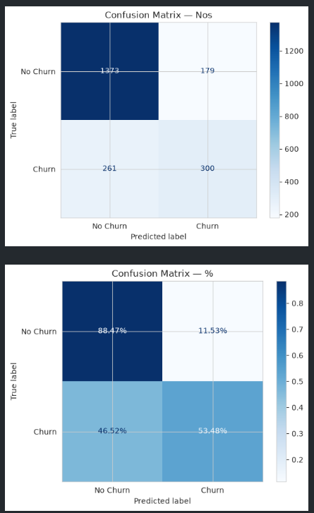
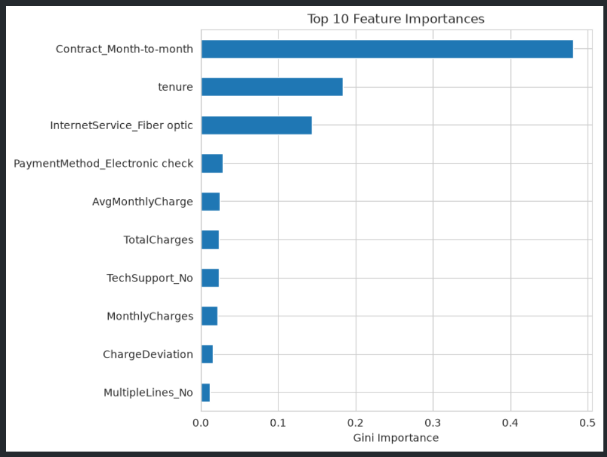
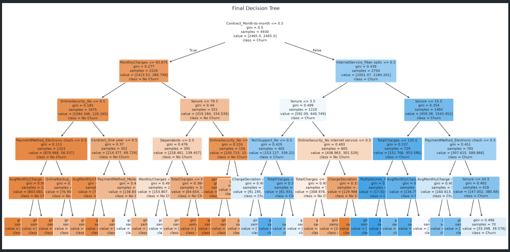

# Telecom Customer Churn Prediction
ML based customer churn prediction service for telecommunications company.

## 1. Data Understanding & Preparation 
Carried out
1. Data type and structure checks 
2. Missing-value analysis
   1. Nulls
   2. Empty strings in TotalCharges
3. Duplicate analysis 
4. Numerical and categorical feature identification 
5. Target-variable analysis
   1. Data imbalance observed (Churn Yes: 73.46%, Churn No: 26.54%)
6. Data cleaning and preprocessing
   1. Total charges to numeric
   2. Customers observed with tenure 0 (new customers)
   3. Drop identifier column (no predictive value)
   4. Strip whitespaces from all string columns
7.  Encoding of categorical variables
    1.  Binary: Gender, Yes/No
    2.  Multi category columns: 10 (to bool => to 0/1)
8.  Train/Test Split
    1.  70:30 split for training and testing
    2.  Class imbalance to be maintained in the split (via stratify)
9.  Random state = 42; reproducibility. 

## 2. Exploratory Data Analysis 
EDA carried out on data prior encoding otherwise contextual information would have been spread out too much.  
Insights from visualizations
1. Churn distribution
   1. There is 26.5% churn rate. Imbalanced target variable indicates that the training testing split needs to maintain this ratio.
   2. Accuracy alone won't be a fair model metric as it will also be considering `Churn:No` customers, which are a huge part of the dataset.
2. Customer/service characteristics
   1. Most customers sit on month-to-month contracts and more than 50% use fiber optic internet, worth noting because (see next chart) those same segments tend to be the highest-churn ones, meaning a large share of the base already sits in the "at-risk" profile. 
3. Churn against important customer attributes
   1. Churn rate by contract type
      1. Month-to-month customers usually churn at several times the rate of one/two-year contract holders.
      2. Contract length is generally the single strongest categorical churn driver (commitment period matters).
   2. Churn by internet service and payment type
      1. Fiber optic customers churn 2x more than DSL customers (maybe pricing or reliability complaints)
      2. Electronic-check payers churn more than 2x, than customers on automatic bank/card payments.
4. Numerical variable distributions/relationships
   1. Churners typically cluster heavily at low tenure, the first several months are usually the highest-risk window for losing a customer.
   2. Low TotalCharges among churners seems to be a side effect of that short tenure rather than an independent driver, since it accumulates over time.
5. Correlation heatmap (numerical features + churn)
   1. tenure shows the strongest negative correlation with churn among the numeric features.
   2. TotalCharges tends to correlate very highly with tenure itself (by design and logical, and carry overlapping information)

## 3. Feature Engineering 
Created 3 features that could potentially improve churn prediction. 
1. **Tenure Group**
   1. How
      1. Bucket the continuous tenure column into four ordinal stages that roughly map to a customer's relationship lifecycle — brand new, settling in, established, long-term.
   2. Useful because
      1. EDA shows churn is heavily concentrated in low tenure and drops off sharply after. That's not a straight-line relationship, it's closer to a cliff in year one.
      2. Binning makes this non-linearity explicit, and it is a much easier feature to act on in business terms ("customers under 1 year are the priority retention segment") than a raw month count.
2. **Total services subscribed**
   1. How
      1. Count of total services subscribed by customer, PhoneService, MultipleLines, InternetService, OnlineSecurity, OnlineBackup, DeviceProtection, TechSupport, StreamingTV, StreamingMovies
   2. Useful because
      1. A customer using more services may have a stronger relationship with the company and may be less likely to churn. It gives the model a single measure of the customer's overall service usage.
3. **Charge deviation (recent bill change)**
   1. How
      1. AvgMonthlyCharge is each customer's historical average spend (TotalCharges / tenure, with tenure=0 treated as 1 to avoid division by zero; those customers correctly get an average of 0, matching their $0 total charges).
      2. ChargeDeviation is the gap between what they're currently being billed (MonthlyCharges) and that historical average.
   2. Useful because
      1. A positive value means the customer's current bill is higher than what they've historically paid; a promo expiring, a plan change, or a price increase.
      2. MonthlyCharges or TotalCharges alone only show the level of spend, not whether it just changed, and a sudden increase is a classic churn could be a trigger for customers whose absolute bill isn't unusually high.


## 4. Model Development 
Tested 3 Model configurations:
1. Baseline (unconstrained) tree
   1. MaxDepth = None
   2. Higher train accuracy (~1) and lower test accruacy (0.72) id due to unconstrained depth of tree.
   3. This is tree memorizing noise in the training data rather than learning generalizable churn patterns.
   ```
   Baseline — Train acc: 0.998 | Test acc: 0.719
               precision    recall  f1-score   support

      No Churn       0.81      0.81      0.81      1552
         Churn       0.47      0.48      0.47       561

      accuracy                           0.72      2113
      macro avg       0.64      0.64      0.64      2113
   weighted avg       0.72      0.72      0.72      2113

   ROC-AUC: 0.643
   ```
   4. ROC-AUC indicates "Weak" (0.6 - 0.7) : means the model is weak at clearly separating the classes "Churn Yes" and "Churn No"
2. Constrained tree
   1. max_depth=5, min_samples_leaf=30, class_weight='balanced'
   2. Max depth and min samples leaf cap how much the tree can twist itself around individual training rows, which should shrink the train/test gap from baseline model.
   3. Class weight balanced directly addresses the churn class imbalance, without it, a tree can rack up decent overall accuracy just by leaning toward predicting "No Churn" which is exactly the wrong bias for a retention use case where missing an actual churner is the costly error.
   ```
   Constrained — Train acc: 0.709 | Test acc: 0.695
               precision    recall  f1-score   support

      No Churn       0.92      0.64      0.75      1552
         Churn       0.46      0.86      0.60       561

      accuracy                           0.69      2113
      macro avg       0.69      0.75      0.68      2113
   weighted avg       0.80      0.69      0.71      2113

   ROC-AUC: 0.831
   ```
   4. ROC-AUC 0.831 is reasonably strong.
3. Grid-searched Decision Tree
   1. Two hand-picked configs satisfy the requirement, but a small grid search gives a defensible "best of many" candidate rather than two arbitrary guesses.
   2. Scoring based on 'roc_auc' instead of 'accuracy' because target is imbalanced
   3. Best params: {'class_weight': None, 'criterion': 'gini', 'max_depth': 7, 'min_samples_leaf': 50}
   4. Best CV ROC-AUC: ~0.83 (Strong)
   ```
                 precision    recall  f1-score   support

      No Churn       0.84      0.88      0.86      1552
         Churn       0.63      0.53      0.58       561

      accuracy                           0.79      2113
      macro avg       0.73      0.71      0.72      2113
   weighted avg       0.78      0.79      0.79      2113

   ROC-AUC: 0.824
   ```

**Comparing models**
```
                      Model  Train Acc  Test Acc  Precision (Churn)  Recall (Churn)  F1 (Churn)   ROC-AUC
0  Baseline (unconstrained)   0.997972  0.718883           0.471002        0.477718    0.474336  0.642820
1      Constrained (manual)   0.708519  0.694747           0.459770        0.855615    0.598131  0.831207
2     Grid-searched (tuned)   0.811359  0.791765           0.626305        0.534759    0.576923  0.824440
```

**Selecting and justifying the final model**
1. Discarding the baseline as its train/test gap is large (overfitting)
2. Between the constrained and tuned models - **Constrained Model**

**Reasoning and evaluation**
1. The key metric for churn is Recall: of all customers who actually churn, how many did we identify?
2. The constrained model finds 85.6% of churners, compared with only 53.5% for the tuned model.
3. It does sacrifice accuracy (69.5% vs 79.2%), but it is much better at catching potential churners.
4. Recall = 85.6% → catches about 86 out of 100 actual churners.
5. Precision = 46.0% → of the customers the model predicts will churn, only about 46% actually churn
6. Therefore, about 54% of the customers flagged as potential churners will not actually churn, these are false positives.

**Tradeoff**
1. Higher recall catches more real churners, but also flags more customers who wouldn't have churned.
2. Can still be useful if the cost of missing a churner is higher than the cost of offering a retention incentive to someone who wasn't going to churn.


## 5. Model Evaluation 
Constrained model (Final model) evaluation
1. Accuracy 69.5% `(TP+TN)/(TP+TN+FP+FN)`​
   1. Out of 100 customers, the model correctly predicts the churn/non-churn status of about 69 customers.
2. Precision 46.0% `TP/(TP+FP)​`
   1. If the model flags 100 customers as likely to churn.
   2. Only about 46 actually churn.
   3. The other 54 are false positives, the model thought they would churn, but they didn't.  
3. Recall 85.6% `TP/(TP+FN)​`
   1. if 100 customers actually churn.
   2. **The model identifies about 86 of them.**
   3. It misses only about 14 churners.
   4. This is particularly useful for churn prediction so we don't miss customers who are genuinely at risk.
4. F1 Score 59.8% `2 × (Precision * Recall) / (Precision + Recall​)`
   1. It reflects the trade-off, the model catches many churners, but it also produces quite a few false positives.
5. Confusion Matrix 
   ```
   | Actual       | Predicted No Churn | Predicted Churn |
   +--------------+--------------------+-----------------+
   | **No Churn** |         **1373**   |       **179**   |
   | **Churn**    |          **261**   |       **300**   |
   ```
   1. 1373 True Negative (TN)
      1. 1,373 customers did not churn, and the model correctly predicted No Churn.
   2. 179 False Positive (FP)
      1. 179 customers did not churn, but the model predicted Churn.
      2. Customers unnecessarily targeted with retention offers.
   3. 261 False Negative (FN):
      1. 261 customers actually churned, but the model predicted No Churn.
      2. These are missed churners, potentially more costly for the business.
   4. 300 True Positive (TP):
      1. 300 customers actually churned, and the model correctly predicted Churn.

> For a telecom company trying to identify customers who may churn, would you prioritize Precision or Recall? Why? 
I would generally prioritize **Recall**, because missing a customer who is actually going to churn can mean losing that customer and their future revenue. High recall means the model catches more of these at-risk customers.
The company can then target the flagged customers with retention offers, accepting that some offers will go to customers who weren't going to churn.

## 6. Model Interpretation 
1. Feature importance 
2. Top features influencing churn 
   1. **Month to month contract** is the most impacting feature.
   2. **Tenure** is next, customers with lower tenure seem to be churning most
   3. Users of **fiber optic service** is the third highest impacting feature.
3. Decision Tree visualization and interpretation
   1. 
   2. The decision tree indicates that contract type, tenure, monthly charges, internet service type, and subscribed support/security services are important factors in predicting customer churn. Month-to-month customers receive particular attention, with factors such as fiber-optic service, tenure, payment method, and additional services further influencing the prediction.

## 7. Model Saving & API
1. `notebook/churn_analysis.ipynb` is where the understanding and development is done, but it is not modular.
2. `utils/utils.py` contains the **FeatureEngineer** and **Pipeline** objects, which enables to reuse the pipeline to work with new unseen data. The whole preprocessing and transformation logic sits in the pipeline.
3. This pipeline is used in `notebook/pipeline_based_analysis.ipynb` to show DRY usage, yielding `model/telco_churn_pipeline_latest.joblib` which is the saved pipeline object.
4. REST API
   1. `main.py` contains the fastapi app, loads the pipeline at the server startup.
   2. `/predict` endpoint receives customer data
   3. The pipeline now gets into actions, does the preprocessing, transformations and makes the prediction with a score.
   4. User gets the prediction.
   5. cURL for `/predict` api 
   ```sh
   curl --location 'http://localhost:8000/predict' \
   --header 'Content-Type: application/json' \
   --data '{
      "customerID": "9999-XYZ",
      "gender": "Female",
      "SeniorCitizen": 0,
      "Partner": "Yes",
      "Dependents": "No",
      "tenure": 5,
      "PhoneService": "Yes",
      "MultipleLines": "No",
      "InternetService": "Fiber optic",
      "OnlineSecurity": "No",
      "OnlineBackup": "No",
      "DeviceProtection": "No",
      "TechSupport": "No",
      "StreamingTV": "No",
      "StreamingMovies": "No",
      "Contract": "Month-to-month",
      "PaperlessBilling": "Yes",
      "PaymentMethod": "Electronic check",
      "MonthlyCharges": 85.0,
      "TotalCharges": 425.0
   }'
   ```
   6. Input and output data validation is done using pydantic models.

## 8. Set up and Run
1. `uv sync` will create a virtual env and install all necessary dependencies mentioned in `pyproject.toml`
2. With VSCode's Jupyter notebook extension, the notebooks can be run. Ensure to select the virtualenv.
3. `uvicorn main:app` runs the fastapi app, serving the `/health` and `/predict` endpoints.
4. CURL for churn prediction is mentioned in step 7